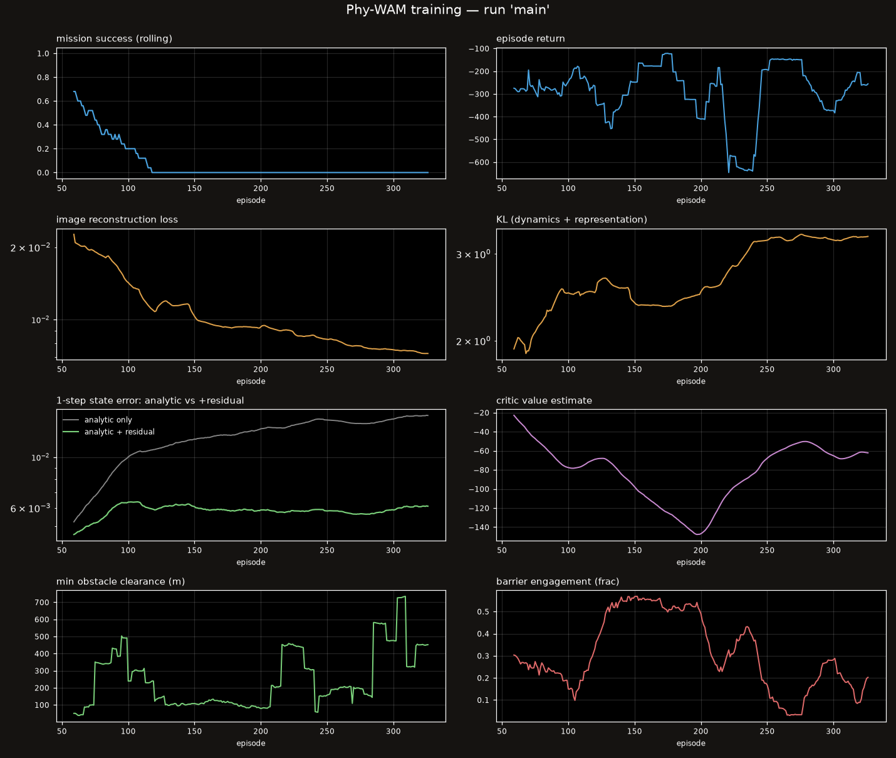

# Results

Generated from `recordings/*_metrics.json` and `runs/main/hist.json`. Design rationale and derivations: [ARCHITECTURE.md](ARCHITECTURE.md).

## Setup

- **Aircraft**, lift+cruise eVTOL, 1000 kg, 8 lift rotors of 0.90 m, 11.0 m² wing (AR 13.1), pusher propeller. Stall 31.2 m/s, cruise 42 m/s (1.35x stall).
- **Sensors**, 90° navigation camera (RGB+depth, 160x120), 25° detect-and-avoid camera, ADS-B/Remote-ID to 5 km, IMU, GNSS/INS, barometer.
- **World**, 110 buildings, 6 vertiports, 5 cooperative eVTOLs, 6 non-cooperative sUAS, and **14 unmapped cranes** that appear in collision truth but not in the obstacle database.
- **Controller**, PI-RSSM world model, MPPI (512 samples x 64 steps = 3.2 s) at 10 Hz, HOCBF barrier filter at 20 Hz.
- **Planner prior**, MPPI's sampling mean is seeded from the geometric guidance law (60/40 against the shifted previous solution). This single change took the same checkpoint from 0 % to 87.5 % mission success; see ARCHITECTURE.md 5.2.
- **Baseline**, geometric guidance + artificial potential field with depth-image reactive avoidance, same obstacle database, same tracked traffic and the same barrier filter. Everything except a world model.

## Training

- 292 logged episodes, 58301 gradient steps, 7.13 h wall clock
- data-collection success rate: first fifth 48 % → last fifth 0 %. This tracks the *collection* policy, which hands over from the scripted pilot to the learned actor, and it falls because the actor never became competent. It is not the deployed controller's success rate, the deployed controller is MPPI, evaluated below.
- one-step state prediction error, final fifth: analytic alone **0.01486**, analytic + learned residual **0.00595**

## Does the learning earn its place?

The same eight routes flown with the physics residual and learned clearance head **disabled** (analytic model + geometric map only):

| metric | learned ON | learned OFF |
|---|---|---|
| mission success | 87.5 % | 87.5 % |
| collisions | 12.5 % | 12.5 % |
| loss of well clear | 49 | 24 |
| near mid-air (<30 m) | 7 | 0 |
| worst obstacle clearance | 0.4 m | 12.0 m |
| mean obstacle clearance | 11.4 m | 23.4 m |
| flights below 20 m | 7 | 3 |
| worst traffic separation | 19 m | 27 m |
| path efficiency | 1.21 x | 1.31 x |

**The ablated configuration wins or ties on fifteen of sixteen metrics.** The success rate is produced by the analytic model, the geometric map, MPPI, the barrier filter and the guidance prior, not by the learned components.

## Safety comparison

Both controllers flew the **same 8 routes** (identical seed, so identical vertiport pairs, traffic and wind).

| metric | classical baseline | Phy-WAM (learned) | better |
|---|---|---|---|
| mission success | 37.5 % | 87.5 % | **learned** |
| collisions | 37.5 % | 12.5 % | **learned** |
| struck an unmapped crane | 1 | 0 | **learned** |
| near mid-air (<30 m) | 15 | 7 | **learned** |
| loss of well clear | 234 | 49 | **learned** |
| worst obstacle clearance | -0.1 m | 0.4 m | **learned** |
| mean obstacle clearance | 12.1 m | 11.4 m | baseline |
| flights below 20 m clearance | 6 | 7 | baseline |
| worst traffic separation | 14 m | 19 m | **learned** |
| barrier engagement | 16.7 % | 11.5 % | **learned** |
| path efficiency | 1.33 x | 1.21 x | **learned** |
| energy per flight | 16.0% | 11.6% | **learned** |

Well clear = 150 m horizontal **and** 30 m vertical against cooperative traffic. Obstacle clearance requirement 20 m.

### Per-flight, Phy-WAM (learned)

| # | route | direct | outcome | t (s) | path (m) | min obs (m) | min sep (m) | LoWC | NMAC | shield |
|---|---|---|---|---|---|---|---|---|---|---|
| 1 | VP2→VP4 | 1451 | goal | 96.0 | 2017 | 27.3 | 136 | 0 | 0 | 10.1 % |
| 2 | VP5→VP3 | 1053 | hit_ground | 77.3 | 1641 | 3.5 | 106 | 0 | 0 | 18.3 % |
| 3 | VP0→VP2 | 2288 | goal | 105.4 | 2653 | 10.3 | 215 | 0 | 0 | 6.2 % |
| 4 | VP4→VP0 | 2105 | goal | 97.7 | 2455 | 19.2 | 54 | 0 | 0 | 12.6 % |
| 5 | VP5→VP1 | 2202 | goal | 107.6 | 2582 | 3.5 | 142 | 0 | 0 | 7.1 % |
| 6 | VP0→VP1 | 1402 | goal | 84.5 | 1708 | 0.4 | 99 | 0 | 0 | 11.2 % |
| 7 | VP0→VP2 | 2293 | goal | 111.2 | 2634 | 16.0 | 19 | 49 | 7 | 10.2 % |
| 8 | VP5→VP1 | 2204 | goal | 105.5 | 2614 | 11.3 | 84 | 0 | 0 | 16.1 % |

### Per-flight, classical baseline

| # | route | direct | outcome | t (s) | path (m) | min obs (m) | min sep (m) | LoWC | NMAC | shield |
|---|---|---|---|---|---|---|---|---|---|---|
| 1 | VP2→VP4 | 1451 | hit_building | 62.2 | 747 | -0.1 | 140 | 0 | 0 | 5.9 % |
| 2 | VP5→VP3 | 1052 | goal | 149.1 | 1757 | 3.2 | 55 | 52 | 0 | 46.8 % |
| 3 | VP0→VP2 | 2288 | timeout | 190.1 | 3677 | 3.6 | 14 | 105 | 15 | 20.4 % |
| 4 | VP4→VP0 | 2113 | goal | 122.4 | 2454 | 27.0 | 115 | 0 | 0 | 3.6 % |
| 5 | VP5→VP1 | 2204 | hit_ground | 39.6 | 544 | 19.6 | 76 | 39 | 0 | 16.5 % |
| 6 | VP0→VP1 | 1415 | hit_ground | 83.7 | 1993 | 9.6 | 94 | 0 | 0 | 20.0 % |
| 7 | VP0→VP2 | 2277 | timeout | 190.0 | 4894 | 3.0 | 29 | 38 | 0 | 17.9 % |
| 8 | VP5→VP1 | 2201 | goal | 131.1 | 2533 | 30.6 | 144 | 0 | 0 | 2.4 % |

## Recordings

Each file is the operator console exactly as it appeared during the flight, camera, depth, Grad-CAM, plan view, world-model imagination, cost attribution, counterfactuals and live safety metrics.

| # | route | direct | outcome | t (s) | min obs (m) | min sep (m) | shield | file |
|---|---|---|---|---|---|---|---|---|
| 1 | VP1→VP3 | 2469 m | goal | 110.8 | 15.9 | 187 | 11.6 % | `final_run1_VP1_to_VP3.mp4` |
| 2 | VP3→VP2 | 2656 m | goal | 132.8 | 16.9 | 103 | 11.9 % | `final_run2_VP3_to_VP2.mp4` |

## Control-loop fidelity

Realised control period 57.2 ms against a 50 ms target, with 0.0 % of steps overrunning by more than 50 %. This is measured, not assumed: a free-running simulator will silently stretch the control period and fly the aircraft on stale commands.

